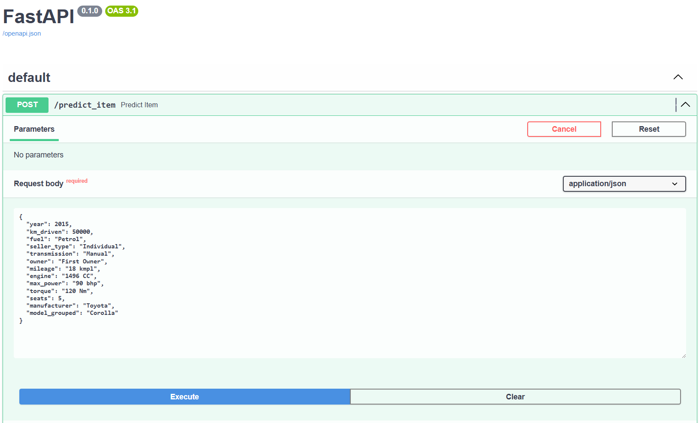
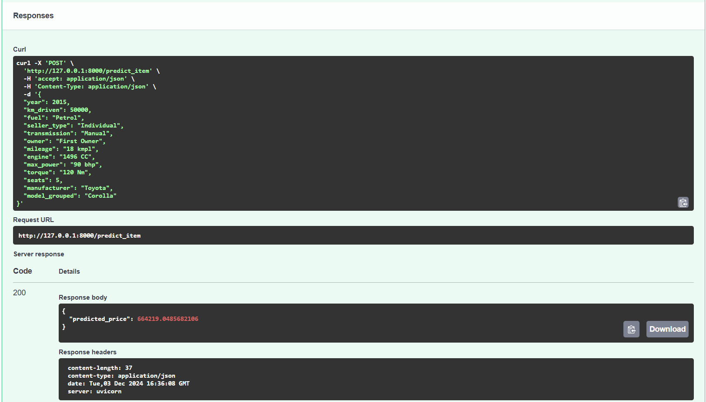
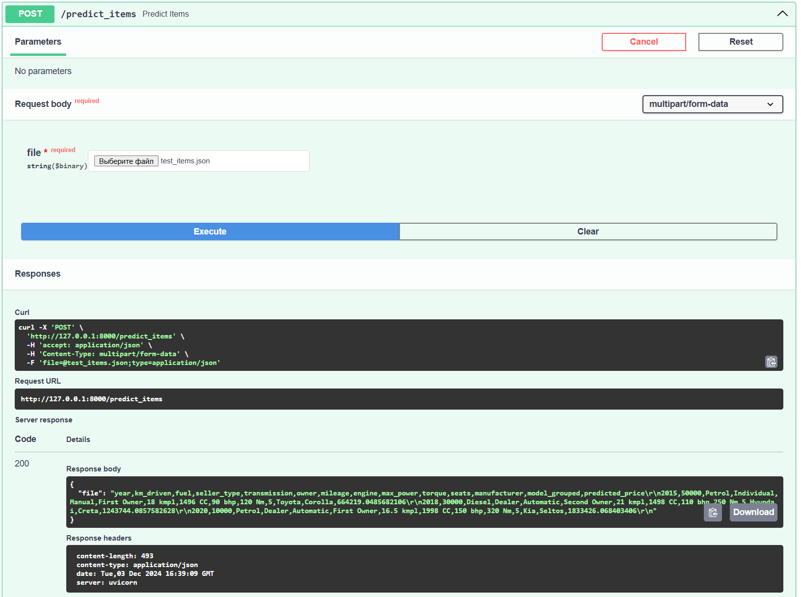

# Отчет о проделанной работе

## Задания в блокноте
- Были выполнены все задания в блокноте. Отчет по конкретным заданиям находится в самом блокноте
- Были выполены различные стадии предобработки данных (анализ фичей, выборка данных, скелинг, обработка )
- Были построены различные модели и подсчитаны метрики для их сравнения

## Модели и результаты

### 1. Модель только на числовых фичах
**Тестовые данные:**
- R^2 = 0.6004
- MSE = 229,728,143,976.7867

### 2. Модель только на числовых фичах с использованием StandardScaler
**Тестовые данные:**
- R^2 = 0.6004
- MSE = 229,728,143,976.7574

### 3. Модель только на числовых фичах с StandardScaler и Lasso
**Тестовые данные:**
- R^2 = 0.6004
- MSE = 229,728,867,977.5177

### 4. Модель только на числовых фичах с StandardScaler и GridSearch (ElasticNet)
**Лучшие параметры:**
- Alpha: 100
- Max Iter: 1000

**Результаты на валидации:**
- Лучший коэффициент регуляризации (alpha): 100
- Лучшее значение R^2: 0.5758

### 5. Модель только на числовых фичах с L0-регуляризацией (AIC и BIC)
**Лучшие результаты:**
- Best AIC: 165,294.89 (features: `seats`, `year`, `km_driven`, `mileage`, `engine`, `max_power`, `torque`)
- Best BIC: 165,348.27 (features: `seats`, `year`, `km_driven`, `mileage`, `engine`, `max_power`, `torque`)

**Результаты на тесте:**
- Test MSE for AIC-selected model: 229,728,143,976.7867
- Test MSE for BIC-selected model: 229,728,143,976.7867
- Train R^2 for AIC-selected model: 0.6004
- Test R^2 for AIC-selected model: 0.6004

### 6. Модель с категориальными фичами и StandardScaler
**Тестовые данные:**
- MSE = 105,430,411,103.2342
- R^2 = 0.8166

### 7. Модель с категориальными фичами и StandardScaler после Feature Engineering
**Тестовые данные:**
- MSE = 110,006,501,774.6535
- R^2 = 0.8086

---

## Наилучшая модель
Наилучшей моделью оказалась **Модель с категориальными фичами и StandardScaler**.

**Результаты:**
- MSE = 105,430,411,103.2342
- R^2 = 0.8166

Эта модель показала наивысшее значение R^2 и наименьшее значение MSE на тестовых данных.

## Что дало наибольший буст в качестве
- Наибольший буст дало применение всех фичей и StandardScaler

## Что сделать не вышло и почему
- Не получилось провести корректный Feature Engineering. Эксперементы не дали значительного роста метрик

## FastAPI сервис
- Был создан FastAPI сервис, который корректно проводить предобработку данных и выдает результаты для одиночных запросов и множественных

## Выводы
- Подход, основанный  регрессионных моделей, показал себя подходящим для поставленно задачи
- FastAPI сервис работает корректно

## Фото

